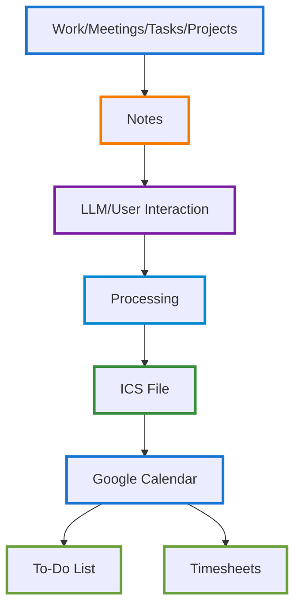

# AI-Augmented Workflow Automation System

## Overview
A productivity system that transforms notes from work, meetings, tasks, and projects into actionable task lists, calendar events, and automated timesheet entries - designed to eliminate administrative overhead and work with ADHD-friendly task structures.

## The Problem
- Notes scattered across platforms and contexts
- Action items lost or forgotten after capture
- Manual timesheet entry consuming 2-3 hours weekly
- Context switching between note-taking and task management
- Traditional task lists overwhelming for ADHD brains
- Difficulty translating notes into concrete next steps

## The Solution
An automated workflow that:
1. Captures notes from any source (meetings, project planning, work sessions, brainstorming)
2. Processes notes through LLM for summarization and action extraction
3. Generates ADHD-optimized task breakdowns
4. Creates ICS calendar files for automated scheduling
5. Auto-populates timesheet data from calendar entries
6. Maintains synchronized to-do lists across systems

## Architecture

